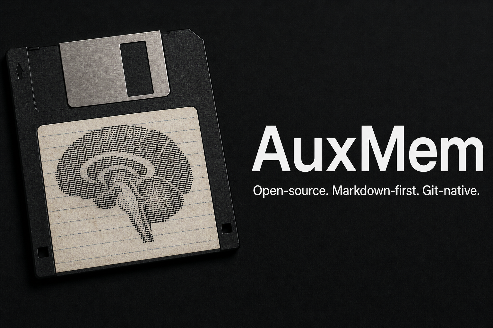

# AuxMem

**AuxMem (auxiliary memory) — plain-markdown memory for AI agents, with a validation gate. No database, no lock-in: delete the tool and your notes are still just markdown and git.**

> **AuxMem** is the project. The **AuxMem Manager** (`auxmem` command) creates and maintains your memory folders. Each folder is an **auxmem** — what a vault is to Obsidian, an auxmem is to AuxMem, except the folder works without the app: delete the tooling and your notes are still just markdown and git.

The bet: for governed work memory, **the files are the product, not an index of the product**. An auxmem is a folder of nothing but markdown, YAML frontmatter, git, and todo.txt. No database, no SaaS, no plugins. You and your AI agents (Claude Code, Codex, Gemini CLI) both read and write it, and it stays yours across every model and vendor change.

An auxmem is not a brain: capture and reasoning happen in the tools you already use; the folder holds what must persist.

---

## The problem

AI agents are amnesiac. Every session starts from zero, so the context you built up yesterday, the decisions you made, the people and systems you track, all of it evaporates.

Judge any fix with the turn-it-off test: delete the tooling. With auxmem, delete every script and the memory still works. Notes open in any editor, git still diffs them, grep still finds them. The common fixes fail the test:

- **Provider memory** fails the day you switch vendors. Your context sits on their servers, in their format. You cannot read it, grep it, or move it.
- **A vector database or "second brain" SaaS** fails with its server and its embedding model. Your notes become an opaque index you no longer own.
- **An agent freely maintaining your knowledge base** fails silently. It rewrites a fact, drifts a summary across edits, quietly corrupts the one note you needed to trust.

Worst case with auxmem, you are holding a folder of readable text.

And memory corruption compounds. Wrong code fails loudly, in a test or a stack trace. A wrong note does not crash anything: it gets read, trusted, cited, and folded into later synthesis, and by the time you notice, you cannot say when it went wrong. For personal research, some drift is fine. For work memory, decisions, governance records, stakeholder state, it is a liability. So the rule is absolute: nothing rewrites your knowledge while you sleep.

## The idea

The files are the product. Three commitments follow from that bet:

1. **Open standards only.** Everything is CommonMark, YAML frontmatter, git, and todo.txt. Any human can edit an auxmem in any editor. Any agent can read it with no adapter. It will still open in ten years with no server running.
2. **Governed, not free-form.** A validator and a git hook enforce a frontmatter and structure contract. Metadata stays clean and greppable because it has to. The gate is what lets you and your agents write loosely and still end up with a trustworthy record. Reading is never gated, writing always is: retrieval is plain grep and glob, and nothing enters the record without passing the hook.
3. **Authored, not compiled.** A note enters the record under human accountability. Authoring is *AI-assisted by default and manual when you want*, but synthesis into derived pages is an explicit, provenance-checked step, never a silent runtime process.

"Authored" means accountable, not hand-typed. An agent can draft, restructure, and file a note. You author it in the sense that it is your record and your responsibility. When validation fails, the tooling helps fix it: mechanical errors auto-repair with no model, judgment errors get an agent-drafted fix you accept, and genuinely ambiguous ones ask you. The gate never weakens; the typing stays light.

## Guarantees

Each is falsifiable with the repo cloned:

1. **Every note opens as plain text** with no auxmem tooling installed. Any editor, any grep, any git.
2. **Validation is deterministic.** No model, no network, no server. Same input, same verdict, and it cannot be down.
3. **AI assists around the gate, never inside it.** With every agent offline you can still read, write, validate, and commit.
4. **No auxmem process rewrites your notes unattended.** No daemon, no background enrichment. The one optional scheduled job is git sync, which commits, pushes, and quarantines conflicts to a branch; it never edits note content.
5. **Derived pages cite their sources.** The validator rejects a synthesized page with no source list; the status reporter flags pages whose sources changed since generation.
6. **Sensitive personnel data does not live here, by design.** It belongs in a separate private auxmem on a path no agent is configured to reach. A flag is not access control; the separation is physical, and keeping it that way is your discipline, not the tool's.

## Quick start

```bash
# run in place, no install
./auxmem-cli new

# or install the command
pipx install .        # or: uv tool install .
auxmem new
```

Interactive, or fully scriptable:

```bash
auxmem new --name my-work --path ~/my-work
```

Or pass domains explicitly when you already know the layout:

```bash
auxmem new --name my-work --path ~/my-work \
  --domain 10-projects=projects \
  --domain 20-governance=governance
```

This creates the auxmem, installs the git hook, and sets up shared folders. Point your agent at it and run the `setup-domains` skill to define subject folders (unless you passed `--domain` above). Requires Python 3.10+ and PyYAML. On WSL2, keep auxmem folders on the Linux filesystem.

## Commands

| command | what it does |
|---|---|
| `auxmem new` | create an auxmem (interactive wizard, or `--name/--path`; optional `--domain`) |
| `auxmem seed EXPORT.json` | normalize a Claude, ChatGPT, or Gemini export into a staging corpus |
| `auxmem import-obsidian SRC --dest PATH` | import an existing Obsidian vault |
| `auxmem doctor PATH` | validate an auxmem and refresh its navigation |
| `auxmem upgrade PATH` | migrate an auxmem to the current template version, safely |

See [`docs/USAGE.md`](docs/USAGE.md) for the full reference and [`docs/IMPORTING.md`](docs/IMPORTING.md) for seeding and migration.

## What an auxmem contains

A shallow, stable folder layout optimized for how agents actually retrieve: filesystem and lexical search over descriptive filenames and frontmatter, not vector similarity.

```
my-work/
├── AGENTS.md          agent guide; CLAUDE.md and GEMINI.md point here
├── 00-inbox/          unsorted captures
├── 05-sources/        raw immutable intake, the synthesis queue
├── 10-projects/       your authored domains (10-50, named in your config)
├── 20-governance/
├── 60-decisions/      ADR log, append-only
├── 70-meetings/
├── 71-log/            dated session logs
├── 72-tasks/          todo.txt and done.txt
├── 80-moc/            generated maps of content
├── 85-synthesis/      derived pages, provenance enforced
├── 90-templates/      note templates
├── .skills/           agent workflows (session close, synthesis, fixes)
└── .scripts/          validator, hook, generators, one config file
```

Every note is plain markdown under a frontmatter contract. A real one:

```markdown
---
title: ADR-0002 Postgres over DynamoDB for the billing store
summary: Billing needs transactional integrity across invoice and ledger writes. Postgres wins over DynamoDB despite the operations cost.
type: adr
status: active
domain: projects
created: 2026-07-06
updated: 2026-07-06
tags: [billing, database]
---
## Decision
Use Postgres. Invoice and ledger writes must commit atomically, and the team already operates it in two services.
```

The contract is enforced when a note enters the record:

```
$ python3 .scripts/validate_auxmem.py 20-governance/access-review.md
20-governance/access-review.md
  - missing required field: updated  [auto]
  - use plural 'tags' with list syntax, not 'tag'  [auto]
2 item(s) are auto-fixable: run  python3 .scripts/validate_auxmem.py --fix --all

$ python3 .scripts/validate_auxmem.py --fix 20-governance/access-review.md
auto-fixed 2 item(s):
  20-governance/access-review.md: renamed 'tag' to 'tags'
  20-governance/access-review.md: set missing 'updated' to today
auxmem validation clean.
```

Every auxmem carries its own tooling: a validator, a pre-commit hook, a map-of-content generator, synthesis and graph reporters, and transparent git sync. One config file, `.scripts/auxmem.config.json`, is the single source of truth for domains and the frontmatter contract. Read [`docs/ARCHITECTURE.md`](auxmem/template/docs/ARCHITECTURE.md) (shipped into every auxmem) for why each piece is built the way it is.

It also ships Agent Skills in `.skills/`. These package the auxmem's operating discipline, like closing a session or running synthesis, as reusable workflows, so every agent follows the same procedure instead of drifting from it. Skills are convenience automation around the gate, not part of it: the validator still has the final word. They are provider-independent by the same logic as the notes. Each is plain markdown in the open SKILL.md format, so the same files work in Claude Code, Codex, Gemini CLI, and Cursor with no adapter, and `bootstrap.sh` links them into each agent's directory. Switch vendors and your workflows come with you.

## How it compares

Several recent "markdown brain" projects landed on the same substrate, because it is the right substrate. They differ in *where intelligence lives* and *what you have to run*.

| | substrate | where intelligence lives | you have to run | best at |
|---|---|---|---|---|
| **auxmem** | plain files | authoring discipline + a deterministic gate | nothing (files + git) | governed, portable, durable work memory |
| **Karpathy's LLM Wiki** | plain files | a compile step (agent synthesizes sources into pages) | an agent loop | absorbing large research corpora into synthesized pages |
| **GBrain** | files synced into Postgres | a query-time engine + self-wiring graph + 24/7 daemon | Postgres/pgvector, embeddings, a job queue, a daemon | retrieval quality and autonomous enrichment at scale |
| **OpenBrain** | a database | an MCP server + capture pipeline | Supabase/pgvector, a server | fast multi-channel capture into a shared store |

All four agree that markdown plus git is the right foundation for agent memory. The others compile that foundation into a system they run; auxmem keeps the files as the whole system. The full comparison is in [`docs/COMPARISONS.md`](docs/COMPARISONS.md).

## What auxmem is not

The gate checks structure, not truth. A well-formed false statement passes it. That is exactly why authorship means a person vouches for content, why derived pages must cite sources, and why staleness is detected rather than assumed away. The division of labor: agents do the high-volume work of drafting, restructuring, and searching; a person owns the one act that cannot be taken back, committing a fact to the record.

It is a personal-to-team-scale system, by design. It gives up retrieval quality at massive scale and autonomous enrichment, in exchange for durability, auditability, and portability. If your job is answering questions over tens of thousands of pages of external material, a system like GBrain fits better. If your job is keeping a trustworthy, portable work memory, auxmem fits better.

It is also not a capture firehose. Capture in the tools you already use; let the auxmem hold what must persist.

## Design and philosophy

- [`docs/USAGE.md`](docs/USAGE.md) command reference, including the upgrade and fix workflows
- [`docs/IMPORTING.md`](docs/IMPORTING.md) seeding from AI exports and migrating an Obsidian vault
- [`auxmem/template/docs/ARCHITECTURE.md`](auxmem/template/docs/ARCHITECTURE.md) why each design choice is what it is
- [`auxmem/template/docs/SYNTHESIS.md`](auxmem/template/docs/SYNTHESIS.md) the governed synthesis loop (raw vs derived)
- [`auxmem/template/docs/FIXING.md`](auxmem/template/docs/FIXING.md) the tiered protocol for fixing validation failures

## Status

Building in public. The auxmem template is versioned independently of the CLI, and `auxmem upgrade` migrates existing auxmems to newer template versions with a 3-way merge that never touches your notes. Feedback and issues welcome.

## License

MIT.
